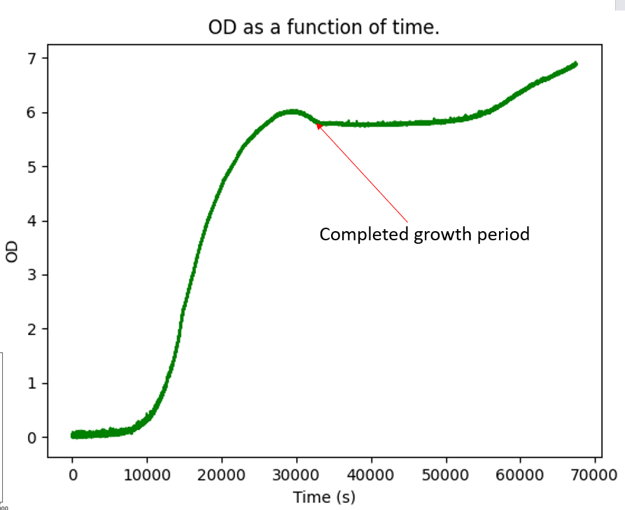

# APEx-grow
APEx grow -> extracting cellular growth data at high temporal resolution within controlled conditions.

APEx grow S = Minimal version (ease of modifications)
APEx grow XL = Standard version (recommended for no modifying)

# Run at 37^o C - E.Coli ~ 20 minutes doubling time

# APEx-grow documentation

For the software and hardware guidance please refer to the documentation:

https://apex-grow.readthedocs.io/en/latest/

# APEx-grow specifications

Variance (error from baseline): 1~3% over prolonged periods of time

Limit of Detection: ~ 0.05 OD -> ~ 6  OD (750 nm LED)

Current maximum run-time (one go): ~ 5-7 days

