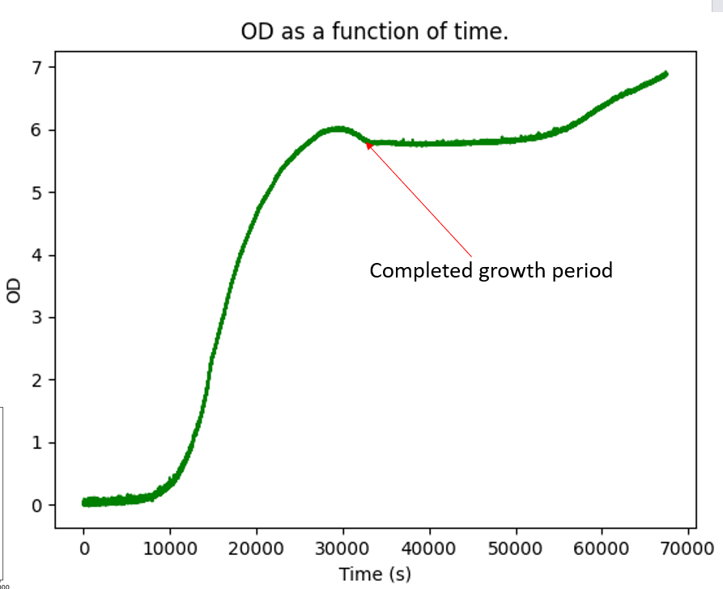

# APEx-grow
APEx grow -> extracting cellular growth data at high temporal resolution within controlled conditions.

# Run at 37^o C - E.Coli ~ 20 minutes doubling time

# APEx-grow documentation

For the software and hardware guidance please refer to the documentation:

https://apex-grow.readthedocs.io/en/latest/
