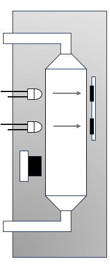

Design Overview
=====

.. _sensor_design:

Sensor Design
---------------
**APEx Grow** uses an inline OD sensor designed around a standard cuvette. This cuvette is 
cut to be open at both ends and then has 3D printed end caps attached to allow it to couple to perestaltic tubing.
This cuvette is then place in a 3D printed sensor housing which blocks out external light and positions a set of leds perpendicular to the cuvette side wall.
Directly opposite each of these LEDs is a photodiode (an opt3002) to measure how much light passes through the liquid. 

In addition to this there is also an IR temperature sensor to measure the temperature of the liquid passing through the cuvette which is then used to regualte the culture temperature.
In total there is space for 5 LED photodiode pairs along with the IR temperature sensor. 4 of these LEDs can also be used to measure the light which scatters and leaves perpendicular to the incident light path.
This can be used to give a second estimate of the optical density.

.. _culture_chamber:

Culture Chamber Design
---------------
lorem

.. _user_interface:

User Interface
---------------
lorem
